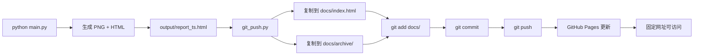

## 用户需求

将现有的多周期K线图生成 Skill 接入 GitHub Pages 托管，实现每次本地运行 `python main.py` 后，自动将生成的 HTML 报告推送到 GitHub，通过固定网址即可访问最新报告。

## 产品概述

用户在本地运行 Python 脚本生成股票 K 线图后，脚本自动将 HTML 报告（内嵌 base64 图片，无外部依赖）推送到 GitHub 仓库，GitHub Pages 将其发布为可公开访问的网页。访问者通过固定网址 `https://用户名.github.io/stock-multi-period-big/` 即可看到最新的多周期 K 线图报告。

## 核心功能

- **自动 push**：`main.py` 生成 HTML 后，自动执行 `git add → commit → push`，无需手动操作
- **固定入口**：每次生成的报告同时另存为 `docs/index.html`，作为 GitHub Pages 的固定访问入口
- **历史归档**：带时间戳的 HTML 也推送到 `docs/archive/` 目录，可查阅历史记录
- **安全隔离**：`.gitignore` 严格排除 `config.yaml`（含 Webhook 密钥）、所有 PNG 文件、`__pycache__` 等敏感或无用内容
- **失败容错**：git push 失败不影响本地图表生成流程，仅打印警告信息
- **可选开关**：通过 `--no-push` 参数跳过 push，方便离线使用

## 技术栈

- Python 标准库 `subprocess`：执行 git 命令，无需额外依赖
- Git / GitHub Pages：托管静态 HTML 文件
- 现有 `report_generator.py`：已完整支持 base64 内嵌图片，无需改动

## 实现方案

### 核心策略

在 `main.py` 现有 HTML 生成逻辑之后，新增一个 `git_push.py` 模块，负责将新生成的 HTML 文件复制到 `docs/` 目录并执行 git push。`main.py` 仅增加一次调用，不修改原有逻辑，最小化改动范围。

**GitHub Pages 固定入口问题的解决方案**：

- 将每次生成的 HTML 报告复制到 `docs/index.html`（覆盖）作为最新报告入口
- 同时复制到 `docs/archive/report_YYYYMMDD_HHMMSS.html` 保留历史
- GitHub Pages 配置为从 `docs/` 目录发布，入口固定为 `docs/index.html`

### 目录结构规划

```
stock-multi-period-big/
├── docs/                        # GitHub Pages 发布目录
│   ├── index.html               # 最新报告（每次覆盖）
│   └── archive/                 # 历史报告归档
│       └── report_YYYYMMDD_HHMMSS.html
├── output/                      # 本地临时输出（不推送）
│   ├── *.png
│   └── report_*.html
├── git_push.py                  # [NEW] git 自动推送模块
├── main.py                      # [MODIFY] 增加 push 调用
├── .gitignore                   # [NEW] 排除敏感文件
└── ...
```

### 数据流



## 实现细节

### git_push.py 模块职责

1. 接收 `html_path`（本次生成的 HTML 文件路径）作为参数
2. 确保 `docs/` 和 `docs/archive/` 目录存在
3. 将 HTML 复制为 `docs/index.html`（覆盖）
4. 将 HTML 复制到 `docs/archive/<原文件名>`
5. 执行 `git add docs/`、`git commit -m "update: report_ts"`、`git push`
6. 每步执行结果打印到控制台，失败时抛出警告但不中断程序

### main.py 修改点

- 在现有 `html_path` 生成成功后，增加约 5 行调用代码
- 通过 `args.no_push` 参数（默认 False）控制是否执行 push
- 原有所有逻辑（图表生成、通知发送）完全不受影响

### .gitignore 内容

```
config.yaml
output/*.png
output/report_*.html
__pycache__/
*.pyc
*.pyo
.DS_Store
```

### 注意事项

- 首次使用需手动创建 GitHub 仓库、`git init`、`git remote add origin`，在 README 中说明步骤
- GitHub Pages 需在仓库 Settings → Pages 中选择 `docs/` 目录，一次性配置
- `docs/archive/` 目录随时间增长，均为纯文本 HTML，体积可控（每个文件约 10-30MB，视股票数量而定）；可在 .gitignore 中加 archive 限制，但默认保留

## 目录结构

```
stock-multi-period-big/
├── docs/                              # [NEW] GitHub Pages 发布根目录
│   ├── index.html                     # [NEW] 最新报告固定入口，每次运行后覆盖更新
│   └── archive/                       # [NEW] 历史报告归档目录
│       └── .gitkeep                   # [NEW] 占位文件，保证目录被 git 追踪
├── git_push.py                        # [NEW] git 自动推送模块，封装 copy+commit+push 全流程
├── main.py                            # [MODIFY] 在 HTML 生成后增加 git_push 调用；新增 --no-push 参数
├── .gitignore                         # [NEW] 排除 config.yaml/output PNG/pycache 等
└── SETUP_GITHUB_PAGES.md             # [NEW] 一次性配置说明（git init、remote、Pages 设置步骤）
```

## Agent Extensions

### Skill

- **git-essentials**
- Purpose: 提供 Git 命令参考，确保 `git_push.py` 中的 git 操作序列（init/add/commit/push/remote）正确无误
- Expected outcome: 生成可靠的 git 命令序列，覆盖首次初始化和日常 push 两种场景